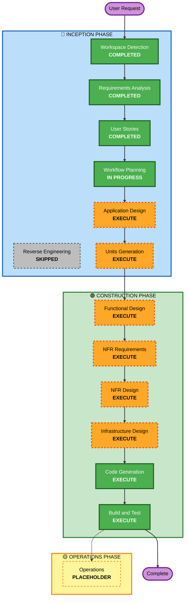

# Execution Plan

## Detailed Analysis Summary

### Project Type
- **Type**: Greenfield (실질적 신규 개발)
- **Note**: 기존 코드는 잘못된 절차로 작성된 부분 구현물이며, 정식 산출물에 따라 검증/재작성됨

### Change Impact Assessment
- **User-facing changes**: ✅ Yes — 검색·등록·비교·리포트 등 직접 사용자 인터페이스
- **Structural changes**: ✅ Yes — 신규 시스템 전체 구조 정의
- **Data model changes**: ✅ Yes — 후보지·실거래가·환경·점수·캐시·운영자 등 다수 도메인 모델
- **API changes**: ✅ Yes — REST API 신규 정의 (사용자 + 운영자)
- **NFR impact**: ✅ Yes — 보안 baseline, PBT, AWS 배포, 모니터링, CI/CD

### Risk Assessment
- **Risk Level**: Medium
- **Rationale**: 
  - 외부 공공 API 5개 의존 → 장애 가능성과 SLA 영향
  - 점수 산정 로직의 정확성 (PBT로 완화)
  - 보안 baseline 강제 (취약점 가능성 완화)
- **Rollback Complexity**: Easy (신규 프로젝트, 운영 트래픽 없음, 기능 단위 롤백 가능)
- **Testing Complexity**: Moderate (외부 API 모킹, Property-based test, E2E)

---

## Workflow Visualization

---

## Phases to Execute

### 🔵 INCEPTION PHASE
- [x] Workspace Detection (COMPLETED)
- [x] Reverse Engineering (SKIPPED)
  - **Rationale**: 기존 코드는 잘못된 절차로 작성된 부분 구현물이라 진정한 reverse engineering 대상이 아님. 사용자가 미리 준비한 입력 자료를 Requirements Analysis 입력으로 활용함.
- [x] Requirements Analysis (COMPLETED)
- [x] User Stories (COMPLETED)
- [x] Workflow Planning (IN PROGRESS - 본 단계)
- [ ] **Application Design - EXECUTE**
  - **Rationale**: 신규 시스템 전체 컴포넌트 식별, 책임 분담, 컴포넌트 메소드와 인터페이스 정의 필요. Search_Engine, Candidate_Manager, Price_Analyzer, Infra_Analyzer, Environment_Analyzer, Safety_Analyzer, Score_Engine, Cache_Manager, Admin_Panel 등 다수 컴포넌트 존재.
- [ ] **Units Generation - EXECUTE**
  - **Rationale**: 시스템이 frontend/backend/admin 등 다수 단위로 구성되어 있고, 외부 API별 모듈, 분석 모듈 등 자연스러운 단위 분해 가능. 각 unit은 독립적으로 개발/테스트 가능.

### 🟢 CONSTRUCTION PHASE
- [ ] **Functional Design - EXECUTE (per-unit)**
  - **Rationale**: 신규 비즈니스 로직(점수 산정, 가중치 적용, 캐시 정책, 데이터 부족 처리, 강점/약점 자동 요약, Haversine 거리 등) 다수. PBT 검증 대상의 정확한 명세 필요.
- [ ] **NFR Requirements - EXECUTE (per-unit)**
  - **Rationale**: 외부 API 의존성, 성능 SLO(p95 1초), 보안 baseline 강제, 99% 가용성 등 unit별 NFR 정밀 분석 필요. 기술 스택 결정도 본 단계에서 확정.
- [ ] **NFR Design - EXECUTE (per-unit)**
  - **Rationale**: Cache 패턴(Read-through + TTL + stale fallback), Retry/Circuit Breaker, Rate Limiting, JWT 인증, bcrypt 해시, 감사 로그 등 NFR 패턴 명시 필요.
- [ ] **Infrastructure Design - EXECUTE (per-unit)**
  - **Rationale**: AWS ECS Fargate + RDS + ElastiCache + S3/CloudFront + ALB + CloudWatch + Secrets Manager + GitHub Actions CI/CD 매핑. IaC(CDK 또는 Terraform) 결정.
- [ ] **Code Generation - EXECUTE (per-unit, ALWAYS)**
  - **Rationale**: 실제 구현 코드 생성. 기존 partial 코드는 검증/재작성 대상. 각 unit별로 Planning + Generation 2단계 진행.
- [ ] **Build and Test - EXECUTE (ALWAYS)**
  - **Rationale**: Unit + Integration + E2E 테스트, PBT 검증, 보안 스캔 통합. CI 파이프라인 검증.

### 🟡 OPERATIONS PHASE
- [ ] Operations - PLACEHOLDER
  - **Rationale**: 향후 확장. 본 워크플로우 범위 밖.

---

## Adaptive Detail Notes

각 stage에서 생성되는 모든 산출물은 항상 작성되며, 내부 detail 수준은 problem complexity에 따라 적응적으로 조정됩니다.

본 프로젝트의 detail level:
- **Comprehensive** (Application Design, Units Generation, Functional Design, NFR Design): 다수 외부 API, 점수 산정 로직, 캐싱 전략, 보안 baseline, AWS 배포로 인한 복잡성
- **Standard** (NFR Requirements, Infrastructure Design): 명확한 결정 사항(AWS ECS Fargate, ElastiCache 등) 존재로 합리적 detail

---

## Estimated Timeline

| Phase | Stage | Estimated Duration |
|-------|-------|--------------------|
| INCEPTION | Application Design | 1일 |
| INCEPTION | Units Generation | 0.5일 |
| CONSTRUCTION | Per-Unit (Functional+NFR+Infra+Code) × N units | 단위당 4-8일 |
| CONSTRUCTION | Build and Test | 2-3일 |

**총 추정 공수 (순차 진행 기준)**: 70 person-days (User Stories 기준)
**병렬 진행 시**: Unit이 독립적이라면 frontend/backend/shared 동시 진행 가능

---

## Success Criteria

### Primary Goal
공공 API 기반 이사 후보 동네 비교 리포트 서비스를 AWS 운영 환경에서 동작 가능한 상태로 구현하고, 모든 39개 User Story의 AC를 자동화 테스트로 검증.

### Key Deliverables
1. **백엔드 API**: 12개 Feature 카테고리의 REST 엔드포인트 (사용자 + 운영자)
2. **프론트엔드 UI**: 사용자용 SPA + 운영자용 Admin Panel
3. **공통 타입 패키지**: shared types
4. **데이터베이스 마이그레이션**: 운영자 계정, 가중치, 캐시 메타데이터 스키마
5. **테스트 스위트**: Unit + Integration + E2E + PBT
6. **AWS 인프라 코드**: CDK 또는 Terraform
7. **CI/CD 파이프라인**: GitHub Actions
8. **운영 문서**: 빌드/테스트 가이드, 보안 정책

### Quality Gates
- ✅ 모든 39개 US의 AC가 자동화 테스트로 검증됨
- ✅ 단위 테스트 커버리지 ≥ 70%
- ✅ Security 스캔 (Bandit/Semgrep/Grype/Gitleaks/Checkov) HIGH/CRITICAL 0건 또는 문서화된 risk acceptance
- ✅ PBT 10개 영역 모두 통과
- ✅ Lint + TypeScript strict 통과
- ✅ E2E 핵심 사용자 여정 통과 (검색 → 등록 → 리포트 → 비교)
- ✅ Local Docker Compose 환경에서 전체 시스템 기동 확인
- ✅ AWS staging 환경 배포 검증

---

## Out of Scope (이번 워크플로우)

- Operations Phase 산출물 (향후 placeholder)
- 실제 AWS 운영 환경 배포 (CI/CD 파이프라인은 정의하되 실배포는 사용자 승인 후 별도)
- 부동산 매물 연동, 가격 예측, ML 추천 (constraints.md 명시)
- 모바일 네이티브 앱 (반응형 웹 UI만)
